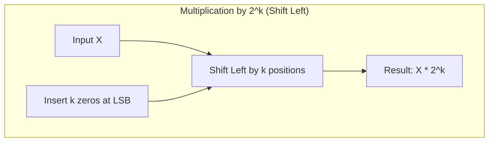
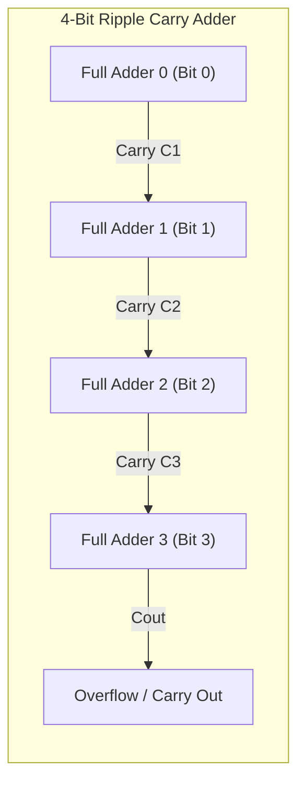

# Bit-Level Arithmetic Operations using Powers of 2 ($2^k$)

In computer systems, binary numbers are fundamentally based on powers of 2. Because digital hardware uses base-2 representation, performing arithmetic operations using powers of 2 ($2^k$) allows processors to execute multiplication, division, modulo, and scaling operations in a single clock cycle using simple bit-shifts and bitwise masks instead of complex arithmetic logic circuits.

---

## 1. Fundamentals of Base-2 Positional Weight

In an $n$-bit binary number, each bit position $i$ (from right to left, $0$ to $n-1$) represents a positional weight of $2^i$:

$$N = b_{n-1} \cdot 2^{n-1} + b_{n-2} \cdot 2^{n-2} + \dots + b_1 \cdot 2^1 + b_0 \cdot 2^0$$

### 8-Bit Positional Power Chart

| Bit Position ($i$) | 7 | 6 | 5 | 4 | 3 | 2 | 1 | 0 |
| :--- | :---: | :---: | :---: | :---: | :---: | :---: | :---: | :---: |
| **Power of 2 ($2^i$)** | $2^7$ | $2^6$ | $2^5$ | $2^4$ | $2^3$ | $2^2$ | $2^1$ | $2^0$ |
| **Decimal Value** | **128** | **64** | **32** | **16** | **8** | **4** | **2** | **1** |

---

## 2. Bit-Level Multiplication by $2^k$ (Shift Left)

### Concept
Multiplying any binary number $X$ by $2^k$ is equivalent to shifting the bit pattern of $X$ to the left by $k$ positions:

$$\text{Product} = X \times 2^k = \text{Shift-Left}(X, k)$$

### Bit Movement Diagram

```
                 ◄── Shift Left by k positions ──
 ┌───┬───┬───┬───┬───┬───┬───┬───┐       ┌───┬───┬───┐
 │ 7 │ 6 │ 5 │ 4 │ 3 │ 2 │ 1 │ 0 │ ◄──── │ 0 │...│ 0 │  (k zeros inserted at LSB)
 └───┴───┴───┴───┴───┴───┴───┴───┘       └───┴───┴───┘
```

### Concrete Example: $5 \times 2^3 = 5 \times 8 = 40$

- **Decimal Formula:** $5 \times 2^3 = 40$
- **Binary Operation:** Shift $0000\,0101_2$ left by $3$ positions ($k = 3$)

```
Original (5):   0  0  0  0  0  1  0  1
                │  │  │  │  │  │  │  │   (Shift Left by 3)
                ▼  ▼  ▼  ▼  ▼  ▼  ▼  ▼
Shifted (40):   0  0  1  0  1  0  0  0  (LSBs filled with 000)
               32 + 8 = 40
```

### Mermaid Diagram: Shift-Left Multiplication Logic



---

## 3. Bit-Level Division by $2^k$ (Shift Right)

### Concept
Dividing an unsigned binary number $X$ by $2^k$ is equivalent to shifting the bit pattern of $X$ to the right by $k$ positions:

$$\text{Quotient} = \left\lfloor \frac{X}{2^k} \right\rfloor = \text{Shift-Right}(X, k)$$

The bits shifted out of the rightmost side represent the **remainder**!

### Bit Movement Diagram

```
 ┌───┬───┬───┐       ┌───┬───┬───┬───┬───┬───┬───┬───┐
 │ 0 │...│ 0 │ ────► │ 7 │ 6 │ 5 │ 4 │ 3 │ 2 │ 1 │ 0 │ ──► Discarded / Remainder
 └───┴───┴───┘       └───┴───┴───┴───┴───┴───┴───┴───┘
 (MSBs filled with 0) ── Shift Right by k positions ──►
```

### Concrete Example: $45 \div 2^3 = 45 \div 8 = 5$ (Remainder: 5)

- **Decimal Formula:** $\lfloor 45 / 8 \rfloor = 5$ with remainder $5$
- **Binary Operation:** Shift $0010\,1101_2$ right by $3$ positions ($k = 3$)

```
Original (45):   0  0  1  0  1  1  0  1
                 │  │  │  │  │  └┬─┴─┬┘
                 ▼  ▼  ▼  ▼  ▼   ▼   ▼  (Shifted out: 101_2 = 5_10 Remainder)
Shifted (5):     0  0  0  0  0  1  0  1
```

- **Quotient:** $0000\,0101_2 = 5_{10}$
- **Remainder:** Bits shifted out $101_2 = 1 \cdot 2^2 + 0 \cdot 2^1 + 1 \cdot 2^0 = 5_{10}$

---

## 4. Bit-Level Modulo Operation ($X \pmod{2^k}$)

### Concept
Computing $X \pmod{2^k}$ extracts the remainder when dividing by $2^k$. At the bit level, this requires isolating the $k$ lowest bits of $X$.

Hardware performs this instantaneously using a bitwise **AND** operation with a mask of $(2^k - 1)$:

$$\text{Remainder} = X \bmod 2^k = X \text{ AND } (2^k - 1)$$

### Mask Construction ($2^k - 1$)
- For $k = 3$: $2^3 - 1 = 8 - 1 = 7_{10} = 0000\,0111_2$ (Lower $3$ bits set to $1$).

### Concrete Example: $45 \bmod 8$

```
  Input X (45):   0  0  1  0  1  1  0  1
  AND Mask (7):   0  0  0  0  0  1  1  1   (2^3 - 1)
  ---------------------------------------
  Result (5):     0  0  0  0  0  1  0  1   (45 mod 8 = 5)
```

---

## 5. Decomposing Arbitrary Multiplication into Powers of 2

Hardware ALUs optimize multiplication by non-powers of 2 by decomposing multipliers into sums or differences of powers of 2.

### Example 1: $X \times 10$
Since $10 = 8 + 2 = 2^3 + 2^1$:

$$\text{Product} = X \times 10 = (X \times 2^3) + (X \times 2^1) = \text{Shift-Left}(X, 3) + \text{Shift-Left}(X, 1)$$

```
  Shift-Left(X, 3)  [X * 8] :  [ Bit pattern shifted left 3 times ]
+ Shift-Left(X, 1)  [X * 2] :  [ Bit pattern shifted left 1 time  ]
--------------------------------------------------------------------
  Result            [X * 10]:  Sum of shifted patterns
```

### Example 2: $X \times 7$ (Booth-like Optimization)
Since $7 = 8 - 1 = 2^3 - 2^0$:

$$\text{Product} = X \times 7 = (X \times 2^3) - X = \text{Shift-Left}(X, 3) - X$$

---

## 6. Bit-Level Binary Addition (Adder Logic)

At the gate/bit level, addition of two bits $A_i$ and $B_i$ with an incoming Carry $C_{in}$ uses binary logic gates:

### Truth Table for Full Adder

| $A_i$ | $B_i$ | $C_{in}$ | **Sum ($S_i$)** | **Carry Out ($C_{out}$)** | Boolean Logic Formula |
| :---: | :---: | :---: | :---: | :---: | :--- |
| 0 | 0 | 0 | **0** | **0** | $S_i = A_i \oplus B_i \oplus C_{in}$ |
| 0 | 1 | 0 | **1** | **0** | $C_{out} = (A_i \cdot B_i) + (C_{in} \cdot (A_i \oplus B_i))$ |
| 1 | 0 | 0 | **1** | **0** | |
| 1 | 1 | 0 | **0** | **1** | |
| 1 | 1 | 1 | **1** | **1** | |

### Bit-Level Addition Diagram (4-bit Ripple Carry Adder)



---

## 7. Bit-Level Subtraction using 2's Complement

To subtract $B$ from $A$ ($A - B$), computers perform addition using the **2's complement** of $B$:

$$\text{Difference} = A - B = A + (-B) = A + \big(\text{NOT}(B) + 1\big)$$

### Steps:
1. Invert all bits of $B$ ($\text{1's Complement} = \text{NOT}(B)$).
2. Add $1$ to the inverted bits ($\text{2's Complement} = -B$).
3. Add $A + (-B)$.

### Example: $7 - 5$ in 4-bit binary
- $A = 7_{10} = 0111_2$
- $B = 5_{10} = 0101_2$

1. **Invert $B$ ($\text{NOT}(B)$):** $1010_2$
2. **Add 1 (2's Complement $-B$):** $1010_2 + 1 = 1011_2$ (which represents $-5$)
3. **Add $A + (-B)$:**
   ```
     0 1 1 1  (7)
   + 1 0 1 1  (-5)
   ---------
   1 0 0 1 0  --> Discard end carry (1) --> Result: 0010_2 = 2_10
   ```

---

## 8. Quick Summary Reference Table

| Operation | Standard Mathematical Expression | Bit-Level Operation Formula | Hardware Implementation | Execution Cost |
| :--- | :--- | :--- | :--- | :--- |
| **Multiplication by $2^k$** | $X \times 2^k$ | $\text{Shift-Left}(X, k)$ | Logical Shift Left | 1 cycle |
| **Division by $2^k$** | $\left\lfloor \frac{X}{2^k} \right\rfloor$ | $\text{Shift-Right}(X, k)$ | Logical / Arithmetic Shift Right | 1 cycle |
| **Modulo $2^k$** | $X \bmod 2^k$ | $X \text{ AND } (2^k - 1)$ | Bitwise AND Mask | 1 cycle |
| **Multiply by $(2^k + 2^m)$** | $X \cdot (2^k + 2^m)$ | $\text{Shift-Left}(X, k) + \text{Shift-Left}(X, m)$ | Parallel Shifts + Addition | 2 cycles |
| **2's Complement Negation** | $-X$ | $\text{NOT}(X) + 1$ | Inverter + Add 1 | 1 cycle |

