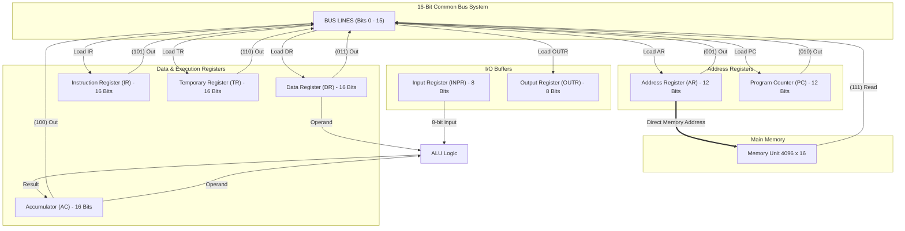

# Fundamental Registers in Basic Computer Architecture: Theory, Architecture, and Execution Trace

---

## 1. Architectural Overview of Computer Registers

In digital computer organization (specifically the classical Mano machine model), **registers** are high-speed, internal CPU storage elements composed of flip-flops. They hold binary information, operands, addresses, instruction codes, and control data during program execution.

### Memory & Register Configuration
- **Memory Unit**: $4096 \times 16$ bits ($4\text{K}$ words of 16 bits each).
- **Address Capacity**: $2^{12} = 4096$ memory locations $\rightarrow$ requires **12-bit** address registers.
- **Data Word Size**: **16 bits** $\rightarrow$ requires **16-bit** operand/instruction/accumulator registers.
- **Input/Output Word Size**: **8 bits** $\rightarrow$ holds ASCII characters.

---

## 2. Detailed Theoretical Analysis of the 8 Basic Computer Registers

### 1. Address Register (AR)
- **Bit Width**: 12 Bits
- **Bus Selection Code**: $(001)_2$
- **Primary Function**: Holds the 12-bit memory address currently being accessed for read or write operations.
- **Direct Hardware Connection**: The output of $\text{AR}$ is tied directly to the address inputs of the Memory Unit ($4096 \times 16$).
- **Microoperations**:
  - Fetch Phase: $\text{AR} \leftarrow \text{PC}$
  - Decode Phase: $\text{AR} \leftarrow \text{IR}(0-11)$
  - Memory Indirect Addressing: $\text{AR} \leftarrow M[\text{AR}]$
  - Increment: $\text{AR} \leftarrow \text{AR} + 1$

### 2. Program Counter (PC)
- **Bit Width**: 12 Bits
- **Bus Selection Code**: $(010)_2$
- **Primary Function**: Keeps track of the execution sequence by holding the memory address of the **next instruction** to be fetched and executed.
- **Microoperations**:
  - Sequential Instruction Flow: $\text{PC} \leftarrow \text{PC} + 1$
  - Branching / Jump: $\text{PC} \leftarrow \text{AR}$
  - Return from Subroutine: $\text{PC} \leftarrow \text{TR}$

### 3. Data Register (DR)
- **Bit Width**: 16 Bits
- **Bus Selection Code**: $(011)_2$
- **Primary Function**: Acts as a memory data buffer. Holds 16-bit data read from memory or ready to be written to memory. It feeds the second operand directly into the Arithmetic Logic Unit (ALU).
- **Microoperations**:
  - Memory Read: $\text{DR} \leftarrow M[\text{AR}]$
  - Register Transfer: $\text{DR} \leftarrow \text{AC}$
  - Increment: $\text{DR} \leftarrow \text{DR} + 1$

### 4. Accumulator (AC)
- **Bit Width**: 16 Bits (with 1-bit Extended Flip-Flop $E$)
- **Bus Selection Code**: $(100)_2$
- **Primary Function**: Main general-purpose processor register. Stores input operands and receives the result of ALU arithmetic and logic microoperations.
- **Microoperations**:
  - Addition: $\text{AC} \leftarrow \text{AC} + \text{DR}, E \leftarrow C_{\text{out}}$
  - Bitwise AND: $\text{AC} \leftarrow \text{AC} \wedge \text{DR}$
  - Clear: $\text{AC} \leftarrow 0$
  - Complement: $\text{AC} \leftarrow \overline{\text{AC}}$
  - Shift Right: $\text{AC} \leftarrow \text{shr } \text{AC}, E \leftarrow \text{AC}(0)$
  - Shift Left: $\text{AC} \leftarrow \text{shl } \text{AC}, E \leftarrow \text{AC}(15)$
  - Character Load: $\text{AC}(0-7) \leftarrow \text{INPR}$

### 5. Instruction Register (IR)
- **Bit Width**: 16 Bits
- **Bus Selection Code**: $(101)_2$
- **Primary Function**: Receives and holds the 16-bit instruction word fetched from memory.
- **Bit Breakdown**:
  - **Bit 15 ($I$)**: Addressing mode ($0 = \text{Direct}$, $1 = \text{Indirect}$).
  - **Bits 14–12 ($\text{Opcode}$)**: Decoded by $3 \times 8$ decoder into timing signals $D_0 \dots D_7$.
  - **Bits 11–0 ($\text{Address/Operand}$)**: Contains target memory address or un-decoded register/IO microoperations.
- **Microoperation**: $\text{IR} \leftarrow M[\text{AR}]$

### 6. Temporary Register (TR)
- **Bit Width**: 16 Bits
- **Bus Selection Code**: $(110)_2$
- **Primary Function**: Internal scratchpad register used by the control unit to store intermediate values during multi-step control sequences (e.g. saving $\text{PC}$ during interrupt handling).
- **Microoperations**: $\text{TR} \leftarrow \text{PC}$, $\text{TR} \leftarrow \text{TR} + 1$

### 7. Input Register (INPR)
- **Bit Width**: 8 Bits
- **Bus Selection Code**: None (Connected directly to ALU inputs)
- **Primary Function**: Receives 8-bit ASCII characters from an input device (keyboard).
- **Handshake Flag**: Input Flag ($FGI$). $FGI = 1$ when character is ready; cleared to $0$ upon transfer to $\text{AC}$.

### 8. Output Register (OUTR)
- **Bit Width**: 8 Bits
- **Bus Selection Code**: None (Loaded directly from $\text{AC}(0-7)$)
- **Primary Function**: Holds 8-bit ASCII characters sent to an output device (display unit).
- **Handshake Flag**: Output Flag ($FGO$). $FGO = 1$ when output device is ready.

---

## 3. Tabled Specifications & Selection Logic

### Master Register Summary Table
| Register Symbol | Register Name | Number of Bits | Bus Selection ($S_2 S_1 S_0$) | Register Function | Control Inputs |
| :---: | :---: | :---: | :---: | :--- | :---: |
| **AR** | Address Register | 12 | $(001)_2$ | Holds memory address | $\text{LD}, \text{INR}, \text{CLR}$ |
| **PC** | Program Counter | 12 | $(010)_2$ | Holds address of next instruction | $\text{LD}, \text{INR}, \text{CLR}$ |
| **DR** | Data Register | 16 | $(011)_2$ | Holds memory operand | $\text{LD}, \text{INR}, \text{CLR}$ |
| **AC** | Accumulator | 16 | $(100)_2$ | Processor register / ALU destination | $\text{LD}, \text{INR}, \text{CLR}$ |
| **IR** | Instruction Register | 16 | $(101)_2$ | Holds fetched instruction code | $\text{LD}$ |
| **TR** | Temporary Register | 16 | $(110)_2$ | Holds temporary internal data | $\text{LD}, \text{INR}, \text{CLR}$ |
| **INPR** | Input Register | 8 | None (Direct to ALU) | Holds input character | None |
| **OUTR** | Output Register | 8 | None (Loaded from AC) | Holds output character | $\text{LD}$ |
| **Memory** | Main RAM ($4\text{K} \times 16$) | 16 | $(111)_2$ | Memory word at $M[\text{AR}]$ | Read / Write |

### 16-Bit Common Bus Multiplexer Selection Table
| $S_2$ | $S_1$ | $S_0$ | Selected Register Output onto Bus | Description / Connection |
| :---: | :---: | :---: | :---: | :--- |
| 0 | 0 | 0 | None | Bus High Impedance State |
| 0 | 0 | 1 | Address Register ($\text{AR}$) | Output placed on Bus lines 0–11 |
| 0 | 1 | 0 | Program Counter ($\text{PC}$) | Output placed on Bus lines 0–11 |
| 0 | 1 | 1 | Data Register ($\text{DR}$) | Output placed on Bus lines 0–15 |
| 1 | 0 | 0 | Accumulator ($\text{AC}$) | Output placed on Bus lines 0–15 |
| 1 | 0 | 1 | Instruction Register ($\text{IR}$) | Output placed on Bus lines 0–15 |
| 1 | 1 | 0 | Temporary Register ($\text{TR}$) | Output placed on Bus lines 0–15 |
| 1 | 1 | 1 | Memory Unit ($M[\text{AR}]$) | Read memory word placed on Bus lines 0–15 |

---

## 4. Tabled Instruction Execution Trace Simulation

Execution trace for:
1. `LDA 205`: Load memory location `205` (value `0x0015`) into `AC`.
2. `ADD 206`: Add memory location `206` (value `0x002A`) to `AC`.

| Instruction | Timing | PC | AR | IR | DR | AC | Active Microoperation & Control Signal |
| :--- | :---: | :---: | :---: | :---: | :---: | :---: | :--- |
| **1. LDA 205** | $T_0$ | 100 | 100 | ---- | ---- | 0000 | $\text{AR} \leftarrow \text{PC}$ ($\text{Bus} \leftarrow \text{PC}, \text{LD}_{\text{AR}}$) |
| | $T_1$ | 101 | 100 | LDA 205 | ---- | 0000 | $\text{IR} \leftarrow M[\text{AR}], \text{PC} \leftarrow \text{PC}+1$ |
| | $T_2$ | 101 | 205 | LDA 205 | ---- | 0000 | Decode Opcode, $\text{AR} \leftarrow \text{IR}(0-11)$ |
| | $T_3$ | 101 | 205 | LDA 205 | ---- | 0000 | Direct Addressing ($I=0$, No-op) |
| | $T_4$ | 101 | 205 | LDA 205 | 0015 | 0000 | $\text{DR} \leftarrow M[\text{AR}]$ (Read Memory) |
| | $T_5$ | 101 | 205 | LDA 205 | 0015 | 0015 | $\text{AC} \leftarrow \text{DR}, \text{SC} \leftarrow 0$ |
| **2. ADD 206** | $T_0$ | 101 | 101 | LDA 205 | 0015 | 0015 | $\text{AR} \leftarrow \text{PC}$ ($\text{Bus} \leftarrow \text{PC}, \text{LD}_{\text{AR}}$) |
| | $T_1$ | 102 | 101 | ADD 206 | 0015 | 0015 | $\text{IR} \leftarrow M[\text{AR}], \text{PC} \leftarrow \text{PC}+1$ |
| | $T_2$ | 102 | 206 | ADD 206 | 0015 | 0015 | Decode Opcode, $\text{AR} \leftarrow \text{IR}(0-11)$ |
| | $T_3$ | 102 | 206 | ADD 206 | 0015 | 0015 | Direct Addressing ($I=0$, No-op) |
| | $T_4$ | 102 | 206 | ADD 206 | 002A | 0015 | $\text{DR} \leftarrow M[\text{AR}]$ (Read Memory Operand) |
| | $T_5$ | 102 | 206 | ADD 206 | 002A | 003F | $\text{AC} \leftarrow \text{AC} + \text{DR}, E \leftarrow C_{\text{out}}, \text{SC} \leftarrow 0$ |

---

## 5. System Architectural Diagrams

### Common Bus Interconnect Architecture Diagram

---

## 6. Document Artifacts

- **Compiled PDF**: `registers.pdf` (Generated using LaTeX via `tectonic`)
- **LaTeX Source Code**: `registers.tex`