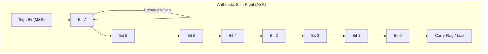

# Shift Instructions in Computer Architecture

Shift micro-operations are used for bit manipulation, serial data transfer, and fast arithmetic operations (multiplication and division by powers of 2).

---

## 1. Logical Shift Left (LSL)

- **Description:**
  - Each bit in the register is shifted one position to the left.
  - The **Most Significant Bit (MSB)** is shifted out into the Carry Flag / lost.
  - The **Least Significant Bit (LSB)** is filled with **0**.
  - **Arithmetic Effect:** Multiplies an unsigned binary integer by $2$ (provided no overflow occurs).

### Diagrammatic Explanation

#### Bit Movement Diagram
```
        ┌─────┐   ┌───┬───┬───┬───┬───┬───┬───┬───┐
Discard ◄─┤ MSB ├─◄─┤ 7 │ 6 │ 5 │ 4 │ 3 │ 2 │ 1 │ 0 ├─◄─ 0 (LSB filled with 0)
        └─────┘   └───┴───┴───┴───┴───┴───┴───┴───┘
```

#### Bit-Shift Step Example (8-bit: 5 → 10)
- **Before Shift:** `0000 0101` (Decimal: 5)
- **After LSL 1:**  `0000 1010` (Decimal: 10)

```
Carry (0) ◄─── [0] ◄─ [0] [0] [0] [0] [1] [0] [1] ◄─── 0
                       │   │   │   │   │   │   │
                       ▼   ▼   ▼   ▼   ▼   ▼   ▼
                      [0] [0] [0] [1] [0] [1] [0]
```

#### Mermaid Flowchart Diagram

```mermaid
flowchart LR
    subgraph LSL ["Logical Shift Left (LSL)"]
        direction LR
        Carry["Carry Flag / Lost"] <-- "MSB" --- B7["Bit 7"]
        B7 <-- B6["Bit 6"]
        B6 <-- B5["Bit 5"]
        B5 <-- B4["Bit 4"]
        B4 <-- B3["Bit 3"]
        B3 <-- B2["Bit 2"]
        B2 <-- B1["Bit 1"]
        B1 <-- B0["Bit 0"]
        B0 <-- Zero["0 (LSB In)"]
    end
```

---

## 2. Logical Shift Right (LSR)

- **Description:**
  - Each bit in the register is shifted one position to the right.
  - The **Least Significant Bit (LSB)** is shifted out into the Carry Flag / lost.
  - The **Most Significant Bit (MSB)** is filled with **0**.
  - **Arithmetic Effect:** Divides an unsigned binary integer by $2$.

### Diagrammatic Explanation

#### Bit Movement Diagram
```
            ┌───┬───┬───┬───┬───┬───┬───┬───┐   ┌─────┐
(MSB) 0 ─►─┤ 7 │ 6 │ 5 │ 4 │ 3 │ 2 │ 1 │ 0 ├─►─┤ LSB ├─► Discard / Carry
            └───┴───┴───┴───┴───┴───┴───┴───┘   └─────┘
```

#### Mermaid Flowchart Diagram


---

## 3. Arithmetic Shift Right (ASR)

- **Description:**
  - Shifts bits to the right while **preserving the sign bit (MSB)**.
  - The original MSB is duplicated into the new MSB position.
  - The LSB is shifted out.
  - **Arithmetic Effect:** Divides a signed 2's complement binary integer by $2$.

### Diagrammatic Explanation

#### Bit Movement Diagram
```
          ┌───┐
          │   ▼
        ┌─┴─┬───┬───┬───┬───┬───┬───┬───┐   ┌─────┐
 Sign ─►│ 7 │ 6 │ 5 │ 4 │ 3 │ 2 │ 1 │ 0 ├─►─┤ LSB ├─► Discard / Carry
(MSB)   └───┴───┴───┴───┴───┴───┴───┴───┘   └─────┘
```

#### Mermaid Flowchart Diagram



---

## 4. Circular Shift / Rotate (ROL & ROR)

- **Description:**
  - Bits shifted out from one end re-enter at the opposite end. No bits are lost.

### Rotate Left (ROL) Diagram
```
  ┌─────────────────────────────────────────────────────────────┐
  │                                                             │
  └───┐   ┌───┬───┬───┬───┬───┬───┬───┬───┐                     │
      └─◄─┤ 7 │ 6 │ 5 │ 4 │ 3 │ 2 │ 1 │ 0 ├─◄───────────────────┘
          └───┴───┴───┴───┴───┴───┴───┴───┘
```

### Rotate Right (ROR) Diagram
```
  ┌─────────────────────────────────────────────────────────────┐
  │                                                             │
  ▼   ┌───┬───┬───┬───┬───┬───┬───┬───┐                         │
  └───┤ 7 │ 6 │ 5 │ 4 │ 3 │ 2 │ 1 │ 0 ├─►───────────────────────┘
      └───┴───┴───┴───┴───┴───┴───┴───┘
```

---

## Summary Comparison Table

| Shift Type | Operation | Leftmost Bit (MSB) | Rightmost Bit (LSB) | Primary Purpose |
| :--- | :--- | :--- | :--- | :--- |
| **LSL** | Logical Shift Left | Shifted out | Filled with `0` | Unsigned Multiplication ($\times 2$) |
| **LSR** | Logical Shift Right | Filled with `0` | Shifted out | Unsigned Division ($\div 2$) |
| **ASL** | Arithmetic Shift Left | Shifted out (check overflow) | Filled with `0` | Signed Multiplication ($\times 2$) |
| **ASR** | Arithmetic Shift Right | Preserved (Sign bit copied) | Shifted out | Signed Division ($\div 2$) |
| **ROL** | Rotate Left | Wraps around to LSB | Receives MSB | Bit rotation |
| **ROR** | Rotate Right | Receives LSB | Wraps around to MSB | Bit rotation |

---

## Related Notes

- For detailed bit-level arithmetic operations using powers of 2 (shifts, masking, multiplication decomposition, full adders, and 2's complement subtraction), see [bit_level_arithmetic.md](file:///c:/Soham/Repositories/BT24DS_TY/1st_sem/Computer_Organization_and_Architecture/bit_level_arithmetic.md).

